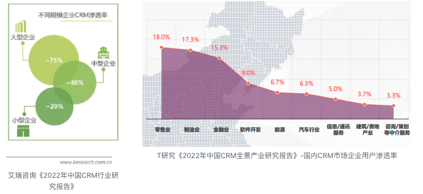
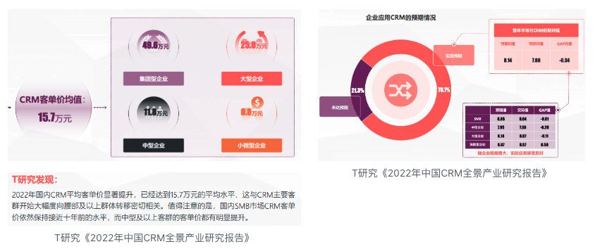
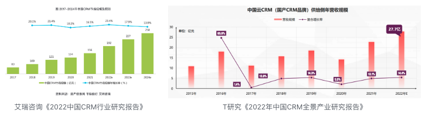
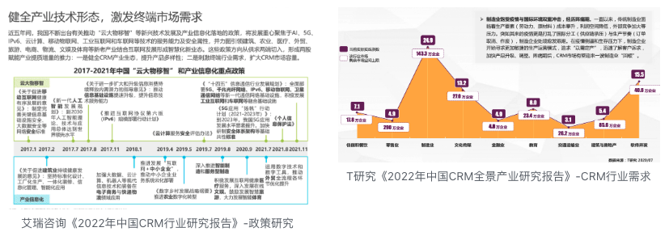
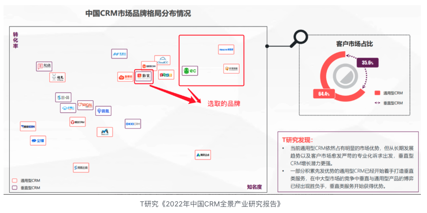
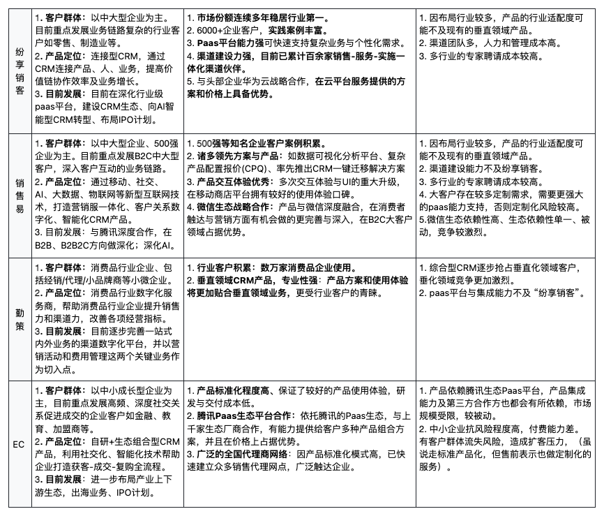
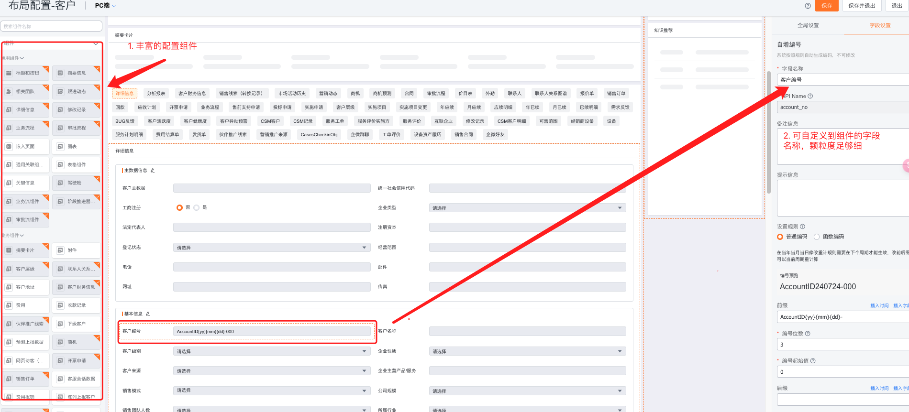

---------
title: "CRM分析报告"
date: 2023-10-01
layout: default
permalink: /blogs/crm-analysis-report/
toc: true
---------
# 纷享销客 CRM 竞品分析报告

# 关键要点

- 纷享销客为中国头部CRM厂商，主要服务中大型企业客户，特别是零售业和制造业等业务链路复杂的行业。
- CRM行业市场规模持续增长，预计2024年达258亿元，年复合增长率约10%。制造业、科技公司和大型传统企业是主要目标客户。
- 行业主要痛点包括：营销获客成本高、线索管理效率低、客户管理难度大、商机管理成功率低。
- CRM解决方案通过建立营销管理、线索管理、客户管理和商机管理平台，提供全面的客户关系管理服务。
- AI已成为行业创新趋势，预计将推动CRM产品功能升级和价值提升。
- 纷享销客在市场份额、平台能力和渠道建设方面具有显著优势，但在行业专业化程度和运营成本方面仍存在挑战。

CRM 即客户关系管理，是指企业或组织与客户交互的过程管理，核心目标是以客户关系为中心发展业务，确保企业与客户在营销、销售、服务上的每一步交互都顺利、高效，从而提升企业业绩与竞争能力。**本文选择我国头部 CRM 厂商-纷享销客为对象**，**从 CRM 行业、纷享销客的产品定位，能力与资源，场景与用户体验四个部分展开分析**。

# 一、CRM 行业分析

## 1.1 客户群体

在国内，CRM 系统的主要使用对象集中在**中大型企业**，产品渗透率较高的行业有**零售业、制造业、金融业**。

## 1.2 客户痛点

1. **营销获客成本高，客户转化率低：** 线上线下营销渠道彼此独立，人工统计，表格汇总的方式数据整理的效率低，难以对多渠道的数据进行及时的分析与效果跟踪，无法有效优化营销工作，客户转化率低。
2. **线索管理难，处理效率低：** 在各渠道线索归集到位，最重要的任务就是快速的跟进客户，提高成单率。但现实常常是一位运营/销售/客服人员需要服务几十上百个客户，员工难以做到合理和及时跟进客户。此外，因客户资料与销售业绩强相关，公司资源客户在线索分配过程中，还会存在人工不公平、分配不合理的问题。
3. **客户管理难，跟进效率低：** 传统模式下，销售人员与客户的沟通采用电话、邮件、微信等方式，文字对话形式的信息难以整合数据，洞察客户。如果销售人员离职，还会导致客户数据的流失，工作无法快速有效的交接，增加重复沟通成本，甚至是重新获客的成本。此外，对于意向度一般的潜在客户，若不进一步对其了解和引导，往往会造成线索的真正流失，导致失去线索转化的机会。
4. **商机管理难，赢单率低：** 一个重要的商机往往涉及到更多部门的团队的参与，商机的粗放式推进，导致团队协作困难，流程进展等关键信息难有全面的了解，最终造成推进管理混乱，成单进程慢，成功几率低。同时留痕记录少，难以开展商机风险预测、复盘等后续工作。

## 1.3 CRM 行业解决方案

1. **针对营销获客成本高，客户转化率低的问题，** 解决方案是：建立营销管理平台。通过多渠道获客数据的统一管理、多维度营销效果分析，实现获客质量与转化效率的提升。
2. **针对线索管理难，处理效率低的问题**，解决方案是：建立线索管理平台。通过线索识别与质量评估、自动化分配等规则设置，实现线索资源的高效与合理化分配，促进线索向客户的转化。
3. **针对客户管理难，跟进效率低的问题，** 解决方案是：建立客户管理平台。统一沉淀客户数据，结合工商查询与信息回填、关联获客、跟进、交付等业务模块构建 360°客户视图，帮助销售人员全面了解客户。此外，对于潜在线索，建立用户标签画像和群体目标分组，按不同目标客群进行批量式运营内容投放，实现有针对性的营销策略，降低人工运营成本、带来更多的客户转化和成单机会。
4. **针对商机管理难，赢单率低的问题，** 解决方案是：建立商机管理平台。通过商机跟进看板，商机风险预测等帮助团队随时了解商机进度、各成员的业务执行状态，及时发现问题，实现精细化、透明化、规范化、可预测的流程管理，从而提升签单率，促进销售业绩的达成。

## 1.4 产品使用意愿及付费能力

**数据显示，中大型企业对 CRM 产品的付费能力强，使用意愿高；小微企业付费能力及持续使用意愿弱。由此可见，中大型企业逐步成为 CRM 市场的中坚力量。**

1. 企业客单价情况及历史走势：2022 年国内 CRM 平均客单价为 15.7 万元/年，中型以上客群的客单价有明显提升，**小微企业年平均客单价几乎近十年都维持在万元左右。**
2. 企业使用意愿：数据表示，企业规模越小，对 CRM 的预期值越高。企业规模越大，对 CRM 服务的预期更加理性，包容度也更高。同时也表示，小微企业难保持对 CRM 产品的持续使用。

   

## 1.5 市场规模与趋势

1. **CRM 市场规模**

尽管 CRM 系统是发展较早的产品，但**我国 CRM 行业市场规模仍然呈现稳定增长的趋势，CRM 市场规模年复合增长率在 10%左右，预计到 2024E，市场规模达到 258 亿元。**

1. **行业发展趋势**

由国家工信部政策文件解读数据可知，我国近年来在国产化、制造产业、高科技创新产业专精特中小企业频出政策。推行工业互联网信息化转型、制造供应链精细化，数字化，全球化、优质中小微企业融资促进等落地方案。同时根据 T 研究《2022 年中国 CRM 全景产业研究》报告可知，CRM 在零售和制造的细分领域具备较大的市场空间。

**由此总结，未来制造业、高成长型的科技公司、大型传统企业是应用数字化产品的主要客户群体。** 此外，Salesforce 2024财年第二季度最新的财报显示，人工智能(AI)是其近期增长的关键驱动力。其季度和全年收入同比增 长了11%，其中AI发挥了重要作用。Salesforce还推出了Einstein Copilot，这是 一款对话式AI助手，预计将进一步提升 生产力和客户互动。这些AI驱动的产品 在专业行业中表现出色，年经常性收入 (ARR)增长超过20%。 Salesforce也表示，尽管AI和像Data Cloud以及GenAI这样的新产品表现出强劲潜力，但预计它们在2025财年 的收入贡献不会显著。然而，Salesforce 对AI的长期影响充满信心，认为它将推动进一步的增长和创新 。**所以 AI 已成为行业解决方案与创收的趋势。**

## 1.6 行业竞争态势

CRM 发展至今，产品成熟度高，厂商众多，产生了综合 CRM 厂商、垂直领域 CRM、SCRM 等多种产品形态。以下选取几位**国内知名度与市场份额较高的领先品牌**做竞争态势分析：

以下是文字版描述：

1. **纷享销客**

- 品牌定位：客户群体主要是中大型企业，目前重点发展业务链路复杂的行业客户如零售、制造业等。产品定位于连接型 CRM，通过 CRM 连接产品、人、业务，提高价值链协作效率及业务增长。目前在深化行业级 paas 平台，建设 CRM 生态、向 AI 智能型 CRM 转型、布局 IPO 计划。
- 优势：

（1）目前是国内市场份额最高的 CRM 服务商。

（2）6000+企业客户，实践案例丰富。

（3）Paas 平台能力强，可快速支持复杂业务与个性化需求。

（4）渠道建设力强，目前已累计百余家销售-服务-实施一体化渠道伙伴。

（5）与头部企业华为云战略合作，在云平台服务提供的方案和价格上具备优势。

- 劣势：

（1）因布局行业较多，产品的行业适配度可能不及现有的垂直领域产品。

（2）渠道团队多，人力和管理成本高。

（3）多行业的专家聘请成本较高。

1. **销售易**

- 品牌定位：客户群体主要是中大型企业、500 强企业，目前重点发展 B2C 中大型客户，深入客户互动的业务链路。产品定位于营销服一体化、客户关系数字化、智能化 CRM 产品。（产品定位主要还是围绕营销服、客户关系业务展开）
- 优势：

（1）500 强等知名企业的客户案例积累。

（2）诸多行业领先方案：如数据可视化分析平台、复杂产品配置报价（CPQ）、率先推出的 CRM 一键迁移方案。

（3）产品交互体验优秀：多次交互体验与 UI 的重大升级，在移动商店平台拥有较好的使用体验口碑。

（4）微信生态战略合作：产品与微信深度融合，在消费者触达与营销方面有机会做的更完善与深入，在 B2C 大客户领域占据优势。

- 劣势：

（1）因布局行业较多，产品的行业适配度可能不及现有的垂直领域产品。

（2）渠道团队数量少，渠道建设能力不及纷享销客。

（3）多行业的专家聘请成本较高。

（4）大客户存在较多定制需求，需要更强大的 paas 能力支持，否则定制化风险较高。

（5）微信生态依赖性高、生态依赖性单一、被动，竞争较激烈。

1. **勤策**

- 品牌定位：客户群体主要是消费品行业企业、包括经销/代理/小品牌商等小微企业。产品定位于消费品行业数字化服务商，帮助消费品行业企业提升销售力和渠道力，改善各项经营指标。目前在逐步完善一站式内外业务的渠道数字化平台，并以营销活动和费用管理这两个关键业务作为切入点。
- 优势：

（1）行业实践案例积累：数万家消费品企业使用。

（2）垂直领域 CRM，专业性强：产品方案和使用体验将更加贴合垂直领域业务，更受行业客户的青睐。

- 劣势：

（1）综合型 CRM 逐步抢占垂直化领域客户，垂化领域竞争更加激烈。

（2）paas 平台与集成能力不及 “纷享销客”。

1. **EC**

- 品牌定位：客户群体主要是中小成长型企业，目前重点发展高频、深度社交关系促进成交的企业客户如金融、教育、加盟商等。产品定位于自研+生态组合型 CRM 产品，帮助企业打造获客-成交-复购全流程。目前进一步布局产业上下游生态，出海业务、IPO 计划。
- 优势：

（1）产品标准化程度高、保证了较好的产品使用体验，研发与交付成本低。

（2）腾讯 Paas 生态平台合作：依托腾讯的 Paas 生态，与上千家生态厂商合作，有能力提供给客户多种产品组合方案，并且在价格上占据优势。

（3）广泛的全国代理商网络：因产品标准化模式高，已快速建立众多销售代理网点，广泛触达企业。

- 劣势：

（1）产品依赖腾讯生态 Paas 平台，产品集成能力及第三方合作方也都会有所依赖，市场规模受限，较被动。

（2）中小企业抗风险程度高，付费能力差。有客户群体流失风险，造成扩客压力，（虽说走标准产品化，但售前表示也做定制化的服务）

竞争态势总结：**我国 CRM 发展成熟，面向大中小微客群的产品均已存在。各厂商的产品都已满足客户对 CRM 的刚需需求（营销服体系），都在向更聚焦的领域深入发展，譬如扩展更聚焦的行业客群、优化关键业务链上的产品，以求客户增量，增强市场竞争力。产业竞争激烈，虽然存在领先品牌但还没出现巨头厂商。 上述厂商中销售易、纷享销客、EC 已经开展 AI 大模型的功能实践。**

在激烈竞争态势下，客户的选择变多，对 CRM 厂商的**产品及服务**要求变高，**这需要厂商提供更加契合、甚至能够引领赋能业务的解决方案，如丰富产品矩阵、支持个性化需求**。同时 CRM 厂商需要**通过提高产品易用性、完善服务管理体系等方式增强服务能力**，把握更多的扩客和续约机会。

# 二、产品定位

## 2.1 目标客群

纷享销客目前主要以中大型企业为主，已经在快消、制造、医疗、家居建材等 11 个细分行业，积累了 6000+客户。

## 2.2 核心产品

纷享销客以连接型 CRM 为特色，提供以客户为中心，全生命周期的价值管理型的 CRM。包括**营销服管理、外部渠道管理、内部协同管理、数据集成与开放平台、BI 分析平台、** 同时依托其强大的 **Paas平台，** 服务更多行业客户。以下对其核心产品做简要的概述：

1. **营销管理：** 提供“获客-培育-转化-分析”的营销一体化解决方案。核心功能包括全渠道获客、用户运营（客户画像管理、会员管理）、营销内容管理、营销自动化。
2. **销售管理：** 提供“市场-线索-商机-报价-订单”的销售成交一体化解决方案。核心功能包括线索管理、客户管理、商机管理、CPQ 定价管理。
3. **服务管理：** 通过“多渠道服务受理、工单自动分派、现场服务、产品维保、”等能力，实现售后服务全流程数字化管理。核心功能包括 线上客服、现场服务管理、知识库。
4. **渠道管理：** 通过将上游企业与下游经销商、代理商的业务连接起来，实现渠道在线订货、客户报备、联合跟进、销售预测、费用管理、门店访销、培训赋能等业务经营的数字化管理，与伙伴共创共赢。核心子产品包括渠道库存管理、代理通、订货通。
5. **智能分析平台（BI）：** 融合营销、销售、服务、渠道多种 CRM 业务场景的可视化分析平台。核心功能包括 可自定义可视化图表平台、权限控制管理、数据订阅。
6. **业务定制平台（PaaS）：** 可以让企业以极低成本，快速构建业务应用，包括业务定制平台（aPaas）、智能分析平台（dPaas）、集成对接平台（iPaas）、业务互联平台（cPaas）、数据分析平台五部分构成。
7. **数据集成平台：** 通过无代码、低代码能力连接企业第三方系统。实现 CRM 与 ERP、OA、企业微信、钉钉、呼叫中心、电子签章、企业自建等系统的数据同步。

## 2.3 产品定位演变历史

<table border="1" cellpadding="6" style="border-collapse: collapse; width: 100%; font-family: Arial; font-size: 14px;">
<colgroup>
    <col style="width:8%">
    <col style="width:8%">
    <col style="width:84%">
</colgroup>
<thead style="background-color: #f2f2f2;">
<tr>
  <th>关键阶段</th>
  <th>年份</th>
  <th>产品定位及关键动态</th>
</tr>
</thead>
<tbody>
<!-- 战略转型前 -->
<tr>
  <td rowspan="3" style="font-weight: bold; vertical-align: top; white-space: nowrap;">战略转型前</td>
  <td style="white-space: nowrap;">2011-2013</td>
  <td><b>公司成立。产品名为"纷享平台"，定位移动OA（协同办公），服务中心企业。</b> </td>
</tr>
<tr>
  <td style="white-space: nowrap;">2013-2015</td>
  <td><b>产品名为"纷享销客"，定位轻量级CRM（客户关系管理）</b>。APP 4.0版本上线打造微信式移动办公平台，截止2015年底，注册用户30万，营收规模近3亿，是行业第二到第三名的收入总和，企业级协同办公领域领军产品。</td>
</tr>
<tr>
  <td style="white-space: nowrap;">2016-2017</td>
  <td><b>产品名为"纷享逍客"，定位移动办公平台</b>。与钉钉进行了一场企业级服务市场中最大的<b>"免费大战"</b>，<b>产品被迫拆分为免费版（OA与IM）和收费版（CRM）</b>。"免费大战"战败后，产品进入战略转型。</td>
</tr>
<!-- 阶段一 -->
<tr>
  <td rowspan="1" style="font-weight: bold; vertical-align: top; white-space: nowrap;">阶段一</td>
  <td style="white-space: nowrap;">2017-2018</td>
  <td><b>产品改回"纷享销客"，定位连接型CRM，面向中大型企业，专注PaaS底层开发</b>。从原本的"销售团队的内涵管控"工具，升级为"连接企业总部、渠道商上下游、合作伙伴"的管理平台。2018年起，纷享销售每年为PaaS平台投入上亿元，近三百人的研发团队中，绝大部分专注做PaaS底层开发。</td>
</tr>
<!-- 阶段二 -->
<tr>
  <td rowspan="1" style="font-weight: bold; vertical-align: top; white-space: nowrap;">阶段二</td>
  <td style="white-space: nowrap;">2018-2021</td>
  <td><b>聚焦于快消、高科、制造三大行业的腰部及以上客户。研发一系列连接企业上下游之间的产品、微信生态产品</b>。2020年，成为华为云生态CRM战略合作伙伴，共同为企业数字化营销构建公有云与混合云服务。与全球销售管理咨询公司RSP达成战略合作，共同构建企业数字化经营新业态。<b>阶段性建设了近百家销售与服务型渠道伙伴</b>。</td>
</tr>
<!-- 阶段三 -->
<tr>
  <td rowspan="1" style="font-weight: bold; vertical-align: top; white-space: nowrap;">阶段三</td>
  <td style="white-space: nowrap;">2022-2024</td>
  <td><b>继续建设行业级PaaS+生态平台</b>，与金普线ERP、通卡数科、工博士、蓝凌OA等进行战略合作。<b>继续深化行业级PaaS平台</b>，在快消行业的aPaaS平台能力已日渐成熟，进一步完善制造业、高科技、现代服务行业的aPaaS平台。成为百度文言一心生态合作伙伴，进行数字化CRM场景建设。<b>2024年7月，推出了纷享AI，未来3年，纷享销售将从业务型的连接型CRM跨越成为智能型CRM</b>。</td>
</tr>
</tbody>
</table>

总结纷享销客的产品定位演变历史，大体可以分为四大阶段：

**战略转型前，“产品定位从 OA 办公到 CRM 再回到 OA”。** 创始人罗旭在接受媒体采访时表示，在创业之初，希望乘着移动互联网的热潮，做一个能够重构中国社会工作方式的产品，将工作元素融入移动互联网。但是历时一年多，产品一直没有营收，通过复盘分析与企业走访，重新把目标切入到刚需领域：销售 CRM。

在转变方向后，虽然产品只满足了外勤、工作记录、客户资料记录。但凭借刚需切入、积极的团队、企业服务赛道风口，直到与钉钉大战前，产品都是高速发展的。在 2015 年钉钉切入协同办公市场后，纷享销客凭借客户量级的先发优势，希望立足于企业服务入口级平台这个更大的市场。但是商业巨头的亿级广告斥资、和纷享销客自身产品可替代性高等劣势因素，企业级 OA 协同办公平台至此宣告失败。

**战略转型后，“重回 CRM 赛道，产品定位于连接型 CRM”。**大战失败后，创始人及团队开始重新思考产品定位，走访客户进行需求验证，发现客户的需求是：怎么和自己的用户/客户产生**更长时间、更多层次、更丰富的数据连接。**“连接型 CRM”因此诞生，它并非是一个客户管理型工具，而是在这个平台中，业务每一环节的玩家都可以因为信息、数据共享而获得效率提升。在重新调整发展战略后，纷享销客至今立足于“连接型 CRM”并进行产品迭代升级：

1. **阶段一：服务中大型客户、专注 paas 平台底层建设**

战略转型后，纷享销客放弃了现金流不稳定，业务内容简单的小企业客群，转为对腰部以上企业服务，并开始大力进行 Paas 平台的建设。

2. **阶段二：瞄准三大行业、打造行业化产品、开发渠道伙伴**

纷享销客一边完善 Paas 平台的建设，一边从快消、制造业等业务链路丰富复杂的行业着手发展客户，并研发了一系列如代理通、订货通等产品帮助企业与上下游之间进行高效业务协作，同时也针对快消行业，研发了门店通、车销管理等行业化产品。这一阶段，纷享销客与华为云达成战略伙伴，完善了 Iaas 平台方面的解决方案，同时开始大力进行渠道伙伴的建设，提升销售、交付与服务能力，扩大市场份额。

3. **阶段三：持续深化行业级产品、布局生态开放平台、迈向智能型 CRM**

在 2022-2023 年期间，纷享销客与金普蝶 ERP、通卡数科、工博士、蓝凌等众多 saas 厂商达成战略合作，布局 CRM 生态开放平台，在 2024 年 7 月，纷享销客推出了纷享 AI，创始人表示，未来 3 年，纷享销客将从业务型的连接型 CRM 跨越成为智能型 CRM，AI 赋能 CRM 产品成为成为企业的得力助手。

## 2.4 核心竞争策略

1. **连接型 CRM ：以客户为中心，赋能企业价值业务**

从品牌演变历史可知，纷享销客自战略转型后，在产品定位上，就区别于传统的 CRM-先专注打造“营销服”这单一业务上的痛点问题，而是直接定位到要以 CRM 为核心，解决企业业务链上的问题。从创始人的访谈中可知，纷享销客的“连接”，从客户视角来看，是连接企业多个组织、连接企业和其上下游各产业；从产品的发展视角来看，纷享销客以 CRM 为出发点，目标是与其他供应商共同服务客户，构建融合和被融合的生态解决方案。

**因“连接”的战略思路，与其他一体化 CRM 产品相比，纷享销客更聚焦于企业业务与业务之间的信息传递、业务价值的体现，** 以集成平台来讲，纷享销客所做的集成并非是传统意义上的被动集成，不得不做，而是主动式的让业务数据互通，提高业务协作效率，赋能业务增长，并且因为产品与企业内部及上下游各个业务深度融合，也同时造就了产品的护城河能力。

ps：客户案例

- 钱江机器人，浙江省内最大的工业机器人本体制造企业，产品广泛应用于汽摩配、3C、五金、食品饮料、金属加工等行业。钱江机器人的销售部总监言：**“几年前市面上可供选择的系统供应商就有很多，但大多数都偏向于解决销售人员的日常工作行为管理，没有深入触及到线索获取、商机跟进、尾款回收等具体环节里面去，缺乏围绕销售的实战经验。”**
- 德迈特医疗，专注于肿瘤微创介入诊疗领域的产品与服务，其中经皮穿刺活检系列产品在国内市场上取得了领先的销售业绩。德迈特医疗的董事长言：**“曾经期望能找到一家公司能提供一站式的解决方案，满足德迈特医疗在 ERP、CRM、OA 等所有信息化系统方面的需求。** 这样的系统似乎能够简化企业的 IT 架构，减少管理和集成的复杂性。**但是很难找到一家公司能够提供全面覆盖所有业务需求的一站式系统。** 每个供应商通常都在自己擅长的细分市场中发展出专业的解决方案。这些公司往往专注于特定的业务流程或功能，**而纷享销客致力于覆盖企业运营的方方面面** 。”

可见，纷享销客的产品能够深入企业业务流程、连接能力强，是被客户选择的重要因素之一。

纷享销客在生态建设上，一方面是积极寻找优秀供应商进行战略合作，比如金蝶、华为云、百度 AI、蓝凌 OA 等业内头部企业，比如通卡数科（快消）、工博士（人工智能）等细分行业企业。另一方面与不少的客户建立了合作模式，如法大大电子合同、保利威企业直播等，进行能力互补，构建服务通路，促进产品市场占有率的增长。**在国内，纷享销客是 CRM 行业中的第一位“以连接-生态化-开放性”的战略思想进行产品实践的，并且多年稳定践行，使产品在大方向上没有走弯路，也拿到了国内 CRM 市场份额第一的好成绩。**

此外，纷享销客虽然从通用型 CRM 做起，但从创始人访谈报道可知，在前期，纷享销客只聚焦快消、高科、制造这三类业务关系复杂的行业并进行深入发展，避免精力分散，同时也形成了行业占有率上的优势。

2. **深度研发Paas平台：持续满足客户复杂多变的需求**

为应对中大型企业的业务复杂和个性化的需求，纷享销客从战略转型之初就坚定的选择了走平台化的产品策略这块难啃的骨头。自 2018 年战略转型之初，纷享销就把自研PaaS平台的任务放到第一优先级，投入上亿元的资金和百人的研发资源，直到 2020 年才开始大力发展渠道伙伴。可见其Paas平台至少历经 3 年多的重点研发，并且至今仍然被持续打磨。而国内市场上有能力与之竞争的友商销售易，在此期间与腾讯战略合作，战略方向偏于 B2C 行业应用的深入。纷享销客的 Paas 平台，因其个性化需求适配能力强、受到众多客户的选择与青睐：

- e 签宝，电子签名行业的第一梯队。过去使用轻量级 CRM 遇到诸多问题，难以跟上业务发展的步伐。**使用纷享销客后，e 签宝通过平台提供的自定义对象、自定义页面、自定义工作流、自定义函数等完整低代码生态，配置了近百个标签，很好的满足了 e 签宝各种定制化需求。** e签宝的CIO言：“相较之市面上其他的 CRM，纷享销客更像是提供了解决方案级的服务，同时具备了标准＋定制，其强大的Paas能力，让各种业务尝试能快速通过配置化或简单开发实现响应。”

3. **强化渠道团队建设，加速市场份额占据优势**

纷享销客的创始人罗旭非常重视渠道伙伴的发展，在媒体采访中言：“想要做好做大软件企业，需要产品强、通路强。” 纷享销客在产品构建基本完善之际，就开始着手大力建设渠道伙伴，创始人亲自带队跑了很多渠道商，目前已经在全国各地发展到了百余家。友商销售易在 CRM 创立较早，但渠道建设的比较晚，目前国内的渠道团队规模实际在 50 家左右。就渠道规模上来说，纷享销客占据很大优势；在渠道质量方面，相较于传统的产品分销与服务外包模式，纷享销客实行直分销商业一体化的合作模式，帮助伙伴做市场推广、招聘、培训、甚至是期权激励，让其具备与总部团队同等甚至更专业的服务能力。 **综述，纷享销客对渠道建设比较重视，较早的在全国各地布局了诸多服务团队，这也是纷享销客市场份额连续多年稳居第一的重要因素。**

## 2.5 优势与挑战

**优势：**

1. **业内市场份额领先，行业实践案例丰富：** 据 IDC 数据，纷享销客自 2020 年起，近 3 年来营收规模与市场份额位居国内 CRM 行业首位，是中国 CRM 行业的领导者。也因为多年高质量的成长，纷享销客已经积累了 6000+中大型企业客户，沉淀了丰富的实践案例与经验，给客户提供了很足的品牌信任度。
2. **产品体系完整，Paas 平台能力领先：** 一方面，纷享销客自研的 CRM 产品，除了具备基本的营销服功能，还有多渠道营销、代理通、订货通、BI 平台等功能，给客户提供一体化的全生命周期的价值管理 CRM 平台。另一方面其 Paas 平台功能全面、完善。让纷享销客能够以更高的效率，更低的成本满足客户各种需求，在激烈的市场竞争中占据优势。

具体来讲，**第一，纷享销客把通用型 Paas 平台的颗粒度做的足够细，** 能够更好的支持企业自建业务体系。以客户管理页的布局自定义为例，配置组件种类丰富，支持通用型、业务型（如发起业务流程管理）、字段型等等；支持配置多种业务关联、**还可以对所关联的页面，比如客户详情页中的表单字段，如名称、公司等进行修改。** 能够支持全面、多样的业务个性化需求（图 1），相比之下，友商销售易的 Paas 平台可配置化程度没有纷享销客的高（图 2、图 3）。

  
  
  ！[销售易](assets/image5.png)

**第二，因 Paas 平台底层能力强，数据互通性高，能快速构建顶层业务设计，** 并且使得前端的配置操作也更加简单易用。比如纷享销客的 BI 数据平台，其数据源继承了 Paas 平台的数据关联关系，友商销售易的 BI 数据平台是预置的数据源是与“销售易内部关联的”独立的数据源。在新建数据表时，如果想要分析的数据，在销售易的预置库里没有，就需要重新创建数据源。但是纷享销客的数据源库一定是全面的，不用再重新创建数据源，直接在提供的库里点击可视化标签，程序会自动铺开数据关联关系，选择要分析的标签对象即可（图 1）。为了优化此问题，销售易做了同步主体数据源和验证异常数据源的功能，但相对来说，纷享销客的继承主体数据的模式，研发实现和维护成本更低、配置操作简单、个性化业务适配度高。

1. **连接+生态化造就产品护城河：** 连接的业务的模式更深入于客户业务体系，同时也造就了产品的护城河能力。此外，连接+生态的模式也具备了天然的客户渠道通路的能力，促进产品市场占有率的增长。
2. **渠道伙伴规模大、质量高：** 纷享销客的渠道伙伴目前发展到全国百余家，从友商销售易售前了解到其渠道团队在 50 家左右，纷享销客在渠道规模上占据优势，另外纷享销客秉持直分销一体化建设，团队质量较高。

**挑战：**

1. **知名大客户案例不足：** 比对纷享销客和友商销售易的客户案例、白皮书等资料，销售易在知名大企业上有更多的客户积累比如海康威视、华大基因、施耐德电气等等，纷享销客类似的客户案例较少。
2. **产品的易用与美观性：** 综合型 CRM 平台，在具备较高灵活性、扩展性强的同时，也会因为功能体系庞大，兼顾通用性等导致产品上手难度高、培训成本高。在某企服点评网上可以看到，大家对产品的易用性和美观度提出的建议较多，对某些可自定义配置的内容了解的不够充分，提议如：操作步骤复杂、产品培训时间长，甚至同一公司每涉及到新业务都需要手册或售后人员的支持；界面略显老旧等。（友商销售易，进行过多次产品交互体验与 UI 的重大升级，尤其是移动端产品，在移动商店平台拥有较好的使用体验口碑。)
3. **产品的维护、交付与售后压力：** 因为通用型+Paas 产品的特性，在保证产品的可扩性和灵活度的同时，增强了 B 端产品实施的难度，尤其是纷享销客的产品业务连接能力强，进一步增加了交付与实施的复杂程度。虽然纷享销客有着比较强壮的渠道团队，但还是需要不断的增强直分销的交付力、服务力，做好团队建设工作是至关重要的环节与挑战。

**总结与建议：** 综述，纷享销客在战略转型后，每一步的思路清晰，稳扎稳打。不过，目前 CRM 市场并未出现巨头玩家，**所以纷享销客需要继续扩大市场份额，保持业内领先地位，可以再攻克一些知名大企业，** 积累更多相关案例，提高领先地位。**在产品方面，要继续优化易用性以降低新客户的上手和培训成本，** 例如：构建与封装行业级平台与应用，实现产品快速上手，降低实施与培训难度。同时，**可以结合连接、AI、最佳实践等品牌特色、先进技术、实践理念，打造更具竞争力的业务赋能型产品。**

# 三、能力与资源

## 3.1 能力

1. **创始人：** 罗旭，原《新京报》常务副总裁，主管销售、财务、行政及信息技术，并参与《新京报》新媒体的管理。用 5 年时间，把新京报推向京城第一早报，年营收达 10 亿元，年均增幅超 30%，以新锐的新闻视角和惊人的发展速度赢得同行以及社会各界的尊重，对于行业市场及用户都有深刻的洞察能力。在创办纷享销客的过程中，历经公司濒临倒闭、心脏骤停等波折后，重整旗鼓，使纷享销客再次成为行业领先品牌，极大的韧性令人尊敬。
2. **品牌：** 纷享销客连续多年占据业内营收规模与市场份额的首位，凭借多年的高速成长，累计服务客户 6000+，拥有丰富的客户资源和实战经验。
3. **Paas 能力：** 纷享销客持续投入百人研发团队专注 Paas 平台建设，是同行业中投入最高、建设时间最长的 Paas 平台。平台功能丰富，支持快速构建业务应用、业务数据互联互通。

## 3.2 资源

1. **融资：** 纷享销客自 2018 年转型连接型 CRM 后，经 3 年多的产品打磨，从 2020 年开始，连续第三年获得资本加持，在 CRM 行业内融资能力领先。
2. **渠道团队：** 纷享销客自 2020 年开始，连续多年的高市场占有率，离不开其 2020 年开始大力建设的渠道合作伙伴。仅 2020 年一年已经在全国发展了百余家销售生态伙伴、和服务型伙伴、实施咨询型伙伴也在不断的完善。

# 四、场景与体验

## 4.1 营销管理

依据纷享销客的产品架构图，营销管理的业务范畴，主要集中在**MTL“从市场到线索”这环节。** 核心功能包括：多渠道获客、多渠道线索管理、市场活动管理等。

### 4.1.1 多渠道营销管理

**痛点或期望：** 营销人员的推广工作涉及到线上（如：官网、搜索引擎、社媒等），线下（如展会、电销）等多种营销模式。**一个营销人员日常可能会管理多个平台的账号，分散监管运营效率低。多渠道线索也会造成留资数据不便汇总、** 人工整理数据作业效率低，不及时的问题，造成客户转化周期长。

**解决方案：**

- **多渠道营销管理**

  纷享销客的营销通支持广告、官网、企微、市场活动等 13 种多渠道营销推广管理。支持企业把官网、搜索引擎等不同的推广渠道接入其平台，同时也支持直接在本平台上创建营销活动（比如创建海报、活动二维码、创建文章并发送到各对接平台）。 并且每一类渠道有独立的营销管理和数据分析板块。

以活动营销为例，在创建活动时可以设置活动成本、线索池归属、二维码或链接来源，当用户扫码或进入某个链接留下信息、电话等资料后，此线索自动纳入系统，并注上来源，作为潜在线索。**在线索池列表能够看到各个渠道的获客线索。**

- **线索身份识别与合并**

  在线索归集的过程中，纷享销客支持 **OneID 唯一身份识别** ，系统对来自不同渠道的用户进行汇总管理，自动统一用户身份。**即：通过手机号+微信 unionid 的模式 统一用户的唯一身份（OneID）**，同时将用户在各渠道发生的行为轨迹，整合归集到线索内，避免出现用户数据杂乱和不统一的情况，降低人工筛选的成本。
- **多业务流程关联**

  在同一个活动或推广下，**系统直接关联了与其相关的流程及数据，比如动产出明细、销售线索、商机，如果没有产生流程和数据，还可以直接在此新建，新建的内容也会同步的关联到相关的环节中。** 纷享销客以这样的模式，实现业务与业务之间数据的高效协同作业。

除以上之外，纷享销客的营销管理平台还支持营销内容的制作、营销活动 SOP 计划的创建、发起面向上下游伙伴的营销推广任务等功能，降低营销团队的管理与协作成本。

### 4.1.2 多渠道营销分析

**业务数据分析实际上贯穿CRM“获客-识别-培育-成交”的全流程，** 以下以营销业务为代表，分析纷享销客BI数据平台，对数据分析业务支持。

**痛点或期望：** 多渠道的线索数据如果不统一整理与分析，**难以了解到哪些渠道能带来更多有效的线索和市场回报。** 所以业务员需要定期的整理营销数据，**但是依靠人工表格处理，难以高效与及时的跟上业务决策，影响营销策略的改进。**

**解决方案：** **纷享销客平台支持制作报表、统计图等数据表。** 业务人员根据业务需求，**自定义关键指标，** 比如内容数据（内容阅读量、阅读时长、转发等）、线索数据（渠道线索数、成交数、订单金额、投入成本等）。实现市场活动投入产出比等数据的实时查看，从而不断地优化营销投放等工作，及时为营销决策提供依据。

- **报表创建**

  **纷享销客的报表支持创建普通报表、交叉报表两种，也可以直接从预制模版中选。**

  - 普通报表：只有纵向列的分组，横向表头依次排开。比如：**查看“**本月**各渠道线索运营情况”。** 那么纵向的列表头有：渠道名称、线索数、线索转客户数、订单数、订单金额、渠道投入金额等。横向的表头有：各渠道线索，如果想要知道分别是谁负责的，可以增加营销渠道负责人。并根据负责人设置列分组。
  - 交叉报表：纵向列、横向行，都有分组。比如：**查看“**本季度各月份**各渠道线索运营情况”，** 那么纵向列有员工及其负责的渠道的分组、横向行有季度、月的分组。
- **统计图创建**

  **纷享销客的统计图可以从模版中选择，或者自主创建，以自主创建为例：**

  选择要分析的对象（自选主题）后，（比如：想要分析客户相关内容，就选择客户主题。想要分析产品销量，就选择产品主题。）系统会展示跟其相关的所有维度和统计指标，便于用户确认是否有自己想要的内容，这些指标在图表编辑制作的时候选用（图1）。

  例如：以“销售线索”为分析对象 ，在编辑区，设置维度是“线索来源”、统计指标是“订单数”、以柱状图展示。那么图表就会展示各个渠道线索的订单数情况（图2）。

从左侧把统计图所需要的维度或指标拖拽到图表编辑区，点击应用可以及时预览图表。

- **统计指标管理**

  统计指标应用在统计图表或报表中，比如“销售线索来源表”中 包含各渠道线索总数、已转化客户线索数、已成单线索数、订单金额数等统计指标。在制表的时候，直接通过拖拽的方式，把想要展示的指标放置到画布中。

  和报表、统计图表一样，纷享销客提供了统计指标模版，并且也支持自定义创建。

  值得注意的是，纷享销客对于指标这种有学习门槛的配置操作，处理的非常易于理解。比如说：创建一个名为 “标记为MQL的数”的指标，其实就是要从所有线索中筛选出来标记了MQL的线索。

  在纷享销客平台中的配置过程：将“销售线索”对象下的“姓名”字段，按照“创建时间”，通过“计数”统计方式。

  并且添加数据范围“线索阶段”“属于”“市场认可线索（MQL）”。（图1）

  其中划线的部分是可选择选项，可以看到，纷享销客通过类似“言语填空”的方式提供配置引导，配置过程更符合思考习惯，具备连贯的逻辑性，与纯粹的排列配置字段相比，配置流程更易理解。
- **模版库**

  纷享销客提供报表模版、统计图模版、数据驾驶舱模版、数据指标模版。管理员可以选择模版直接使用，或基于模版调整。
- **图表应用**

  纷享销客支持把报表、统计图、通过布局管理模式，将其嵌入到首页、线索、客户、商机等对象的首页、列表页、详情页，这样可与业务流程关联融合，便于随时查看与分析数据。

如下图 1 所示的数据看版，可以很清楚的看出，通过官网留资的渠道获得的线索转化率高，赢单额多，再结合各个渠道的 ROI 等数据，营销人员能够有依据的判断接下来在哪个方面加大人力物力的投入。

### 4.1.3 差异化优势与不足

**差异化优势：**

1. **多渠道集成插件：纷享销客的营销推广渠道种类丰富，系统内置营销插件广场供客户选择。**除了支持百度、巨量引擎、腾讯广告等广告对接，还支持像小鹅通、微吼等直播推广、国内外社媒线索采集。友商销售易可能受大股东腾讯的影响，在相关第三方产品选择上受限，目前还是以国内广告（腾讯广告、巨量引擎、百度搜索、百度信息流）和微信两个渠道为主。并且既有支持（已与三方平台对接好，无需二次开发）的种类较少。
2. **在市场活动营销方面，纷享销客支持的场景更完善**。主要体现在两个方面：

第一个是市场线索的全流程录入，在纷享销客平台上创建活动之后，可以上传营销二维码或在线创建营销物料，在现场时引导客户扫码留资后，线索直接关联到该活动的线索池。友商销售易支持市场线索的导入/扫名片/手动创建，无法关联或创建二维码等留资渠道。虽然也可以通过创建微信营销物料，引导客户扫码留资，但是必须要和微信公众号关联，毕竟市场活动和微信是两个渠道，从来源和数据统计上都很不好区分。

第二个是支持市场活动的管理，纷享销客还支持活动内容制作、sop 计划安排、营销日历等关于市场活动的一体化的管理，能够支持大型复杂流程的获客营销，增强了营销工作的标准化管理、便捷性。

**不足：**

1. **多渠道营销管理功能细节处理不到位。**比如创建完营销活动后、是必须要设置获客数据存储到哪个线索池里的，否则扫码等用户数据将存入失败。同理，在创建完表单等营销内容后，也需要设置线索池。但是因为创建和设置页面是分开的（如下图 1-2），所以设置很容易被忽略，需要用户养成习惯，这增加了不必要的使用成本。
2. **数据看板：**纷享销客和销售易的数据平台功能上大体类似，但**销售易在协同、UI 可视化细节方面做的更好**。

- 报表协同（图 1）：销售易除了支持订阅与分享功能外，还支持创建数据表共享协作空间，多个用户可以协作创建数据表和数据驾驶舱，在项目跟进、活动复盘等情况下，团队通过共享空间的模式，协同制作、讨论分析报表；提升多业务线的工作效率。
- UI 可视化（图 2）：销售易更关注产品的 UI 表现，比如数据图表可插入图标、图片、文本，应用在导出、PPT 或对外演示时更加方便、美观。在手机端的 BI 组件配置上，销售可以拖拽调整 BI 视图大小且一排可放置多个，很适合像是 ROI/目标/kPI 等数值型数据，增强了配置效率和报表易读性。（纷享销客目前视图大小配置是输入数值，并且不支持横向排列多个看板）

### 4.1.4 客户案例

1. **保利威，一站式企业直播服务平台**。过去通过人工、群聊、会议、excel 表格的模式进行信息和数据的传播，工作效率低。通过与纷享销客合作，保利威打通了自己的营、销、服全链路流程。现在，通过纷享销客平台，营销人员可以清晰地知道，在百度上投的每一个词条，在知乎上的每一条引流，在字节体系里面的每一条信息流，带来的 ROI，以及最终落到订单上带来的产出。过去可能只是站在市场投放的角度计算 MQL 或 SQL 的价值，现在能够以市场-销售-订单的全链路视角，更好的判断市场工作该往哪个方面去优化与发力**，**提高了员工的工作效率，增强了管理者的决策能力，提高线索的转化率。
2. **观麦科技，主营业务是为农产品配供商提供业务系统**。观麦科技过去在做市场投放时，一个月大概有 50 万元的费用平摊到不同的渠道分支，但每个渠道的转化效能往往只有在最后成交时才能被监控到，这时候钱也已经花出去了，在投放过程中的数据也很难统计。现在用纷享销客把投放的过程也能够管理起来，实时的监测到相关数据，当某渠道的转化率始终没有达到预期的目标时，可以及时的分析与干预，从而降低市场的投放成本，提高线索的转化率。

## 4.2 线索管理

依据纷享销客的产品架构图，线索管理属于**“L2O：从线索到商机”这环节。**核心功能包括：质量评分、查重、分配回收等。

### 4.2.1 线索评分

**痛点或期望：** 各渠道线索归集到位后，最重要的任务就是快速的跟进客户，提高成单率。但现实常常是一位运营/销售/客服人员每天需要服务几十甚至几百个客户，员工难以做到合理和及时跟进客户，造成重要客户被竞对抢先跟进等客户流失。

**解决方案：线索评分的主要作用是帮助员工快速筛选出高质量的客户，让员工可以有优先跟进最有价值的客户，从而提高线索的转化与成单率。**线索评分可以应用在跟进初期做筛选判断，也可以应用于已对有客户，多次营销前的客户价值判断。

纷享销客有自动打分、智能打分两个评分体系。在自动打分评分体系中，有属性规则、行为积分两个维度。

1. **属性规则评分**

   **属性主要是对线索匹配度的判断。**如所属行业、企业规模、工商信息等属性特征，比如行业属性：消费、农牧等。渠道属性：通过线下展会留资的客户设置6分，转介绍的客户设置9分，通过电销呼出渠道的客户设置4分等。
2. **行为积分规则评分**

   **行为积分主要是对线索意向度的判断。**通过对线索用户在各个营销渠道中的行为记录（如关注公众号、访问文章等，）自动累计积分，比如内容相关：客户访问过资料累计3分，客户每访问一次资料累计1分，如果根据以往运营经验看，部分内容转化率较高，则内容部分也可以设置不同的分值。比如活动相关：每报名一次累计1分，参与活动累计5分等。积分的总分值就可以从某种程度上体现出该线索的意向度，进而辅助安排线索跟进策略及优先级。

管理员可以根据本企业的营销策略，选择不同的指标为其设置分数（比如选择属性规则中的行业，设定消费行业的客户为10分，农牧行业为5分；选择行为积分规则中的访问官网，设定每访问一次累计1分等）。

启用某评分规则后，程序会自动对线索进行打分和分数展示，实现线索质量的评估。行为积分还支持看到积分明细。

1. **线索智能打分**

   纷享销客的智能打分，基于企业已有线索，结合跟进记录、高级外勤、工商信息等数据，利用机器学习的算法模型，提炼出影响线索转化的关键因素，并以可视化的形式展现、通过大数据智能化输出每条线索的预计转化概率。

此外，纷享销客在24年下旬推出了AI应用能力，包括大模型评分体系。让AI提炼历史下单客户线索的关键属性指标，包括客户画像、赢单金额等。帮助预测哪些潜在客户最有可能转化为实际客户，使销售团队可以优先处理高潜力的线索，从而提高转化率和销售效率。 传统线索评分体系可作为AI模型训练的关键因素，除此之外，与人工线索评分体系不同的是，AI能够比人工洞察到更多的内容维度，对人工评分体系有指导性作用。 以下展示销售易CRM基于机器学习的算法模型的智能打分体系配置，和纷享销客的AI评分（大模型具备天然的机器学习与算法能力，通过大模型再训练，比如让其主动展示线索需重点关注维度，降低自主研发的成本）：

### 4.2.2 线索分配

**痛点或期望：**通过市场活动、官网留资、广告等渠道获取到的有效线索，需要销售人员进一步跟进与验证，明确其需求与意向，使线索向客户转化。通常情况下，除了销售自拓资源外，公司资源线索会分派给不同销售跟进，此时会面临，线索分配不公平，不合理的问题（比如甲销售熟悉并擅长搞定A业务线产品，但被给予的客户需求总是C业务线等现象）。 并且多来源线索、销售主动添加的线索之间，难免会出现重复的数据，引起跟进撞单等问题。

**解决方案： 对于线索的分配问题，纷享销客支持创建多个线索池，并为不同的线索池设置线索分配规则。**比如按地域创建华北线索池、华东线索池，把属于消费品行业的客户定向分配给有相关经验的销售来跟进，实现线索的自动化分配，增强线索的管理分配与效率。**对于线索重复问题，纷享销客通过查重配置、重复数据合并、重复数据标记等方式，解决线索的重复性问题。**

1. **分配规则**
   1. **设定线索条件：**根据业务需要为线索设置不同分配条件，**可以有效解决线索分配不合理的问题**。比如：针对教育行业，B组D组擅长做国际业务线，可以设定线索在留资时有国际业务线倾向的客户都被分派B组D组，这样提高线索的转化率。比如：针对地产行业，设定在华北地区的线索，分配给华北销售人员等。纷享销客支持为线索添加多个维度的条件范围，（图1）
   2. **设定分配规则：**根据业务需要为线索设置不同分配规则，**可以有效解决线索分配不公平的问题，在纷享销客中包括：线索主动认领、线索循环分配、线索指定分配设定。**
      1. 线索循环分配：比如对于留资信息不明确的客户，设置循环分配模式，如：员工队列有:A、B、C三人，第一批数据有5条，第1条给A、第二条给B依次轮回，当第二批数据来时从C开始分配。
      2. 线索主动认领：开放部分线索让员工主动认领，消除线索分配不公平问题，同时洞察员工的积极性。
      3. 线索指定分配：可以用于鼓励优秀员工或考核员工，比如：定向派发40%（按线索比例或业绩比例的一定配额）的高分线索给业绩优秀的员工让优质销售跟进更多的优质客户，或定向派发不同业务线的线索给实习员工，作为培训考核指标。
   3. **设定员工条件：**比如上述的c，可以分配高分线索给某级别的销售作为奖励或考核指标。纷享销客还支持分配给上下游的员工或部门，满足分销推广、总分部门店等长尾伙伴等组织架构。

总体而言，纷享销客的线索分配体系是：**支持把（某些线索）通过（循环、指定等规则）分配给（某些员工**），线索、员工都可以自定义数据范围。体系设计完善、灵活、精细，可以适配多样化的业务模式，实现线索分配的合理和高效。

1. **线索查重**

   纷享销客支持自定义查重、联合查重、唯一性规则三种查重配置规则，并在用户前端设有快捷入口。当查到重复的数据后，程序自动进行高亮标记，同时提醒相关人员，让更新信息得到及时传达，相关人员可以选择人工归并，或在查重配置里，配置查重结果的处理方式。此外，配置查重结果的内容展示范围可以自定义（如：部分员工没有该条数据查阅权限，以此避免客户信息泄露）。

   联合查重：指联合查重线索与客户与联系人，比如当新线索没有与线索库有重复，但是新线索与某联系人姓名电话匹配，可能代表此人已经离职去新的公司，便于进一步电询核实。这样深度全面的筛查，避免了人工规则配置的数据疏漏，帮助营销和销售人员更好的做线索了解与验证。

### 4.2.3 线索回收

**痛点或期望：**线索分配出去后，就进入线索跟进环节，这一环节会出现的问题有：第一，销售人员没法及时的跟进手上线索，其中的原因可能是线索回收制度问题：比如海外中介机构，涉及到移民、留学、语言培训等不同业务线，像大额订单线索回收周期不易过短，但是像培训类小额订单回收周期就不易设置过长。又或者是销售人员问题：比如某销售员虽然拓客能力强，手上有很多自己拓展的客户线索，但因为手上线索多，跟进速度慢导致部分线索死在自己的手里。第二：对于很久未实现跟进，或跟进失败的线索，需要重新退回到线索池，等待再次培育激活或分配。

**解决方案：线索回收机制如何设计，即能督促销售人员及时完成处理，又能保证资源不浪费，从而提高线索跟进效率。**在纷享销客平台中，主要是通过**“回收规则配置”、“保有量配置”实现。**

比如：纷享销客的客户“基本半导体”，对汽车业务线线索以年为单位推进，所以回收机制需要设定为月或者更长的时间，由此保证了规则的及时性、合理性及效率。又如：纷享销客的客户“华信自动化公司”，根据客户线索的合作意向、所属行业等对客户线索做分级，并设置不同的回收规则，销售人员能够对重点客户优先跟进，提供更好的服务。

1. **回收规则**

   设置线索回收的条件和节点，遵从“（**某些线索）符合（某些条件）回收到（某些线索池）**”。其中线索数据范围、条件、线索池，都可以自定义选择。比如：设置线索级别为A类高质量的线索3天未跟进，就自动退回到线索池，定义线索级别B类的一般级别线索10天未跟进就自动退回，确保线索的高效利用。

同时，支持设置到期预警，以便于在线索接近回收节点时，及时的提醒员工，帮助督促员工加快跟进效率。

1. **保有量设置**

   通过设置线索的保有量，控制销售人员手上的线索数量，避免线索大量堆积集中在某几位成员手里，过多占用资源。

### 4.2.4 差异化优势与不足

**差异化优势：**

1. **线索评分：纷享销客的线索+行为+智能评分模式和灵活的规则设定，使得整体的打分体系全面、可控、精细。**并且在 24 年 4 月份上新了针对消费领域的 RFM 打分模型，该模型可以根据客户最近消费时间、消费金额、消费频次设定得分维度、评估客户情况，增强了面向消费行业的线索评分体系。
2. **线索分配：对于多维度数据交叉的规则配置，纷享销客的功能支持程度和使用体验更好。**比如对于规则如“and/or（且/或）”的配置， 纷享销客的处理相对较好。销售易的规则配置，无法同时支持且和或的关系，如果想交叉配置需要启用高级公式，还需要了解公式的规则，而纷享销客支持在页面直接设置。（虽然，笔者目前还未想到哪些线索分派场景一定需要使用“或”（二者选其一）这个规则。但是对于saas crm厂商来说，能够支持多样化的配置，满足更多不同行业客户是优势。）
3. **线索回收：纷享销客对复杂配置流程的操作设计，交互与使用体验更好。具体来说，配置过程更符合思考习惯，具备连贯的逻辑性，与纯粹的排列配置字段相比，配置流程更易理解，降低了学习成本。以**线索回收为例，纷享销客通过类似“填空模式”清晰的展示了配置操作过程：“（某线索）+符合（某些回收条件）回收到（某线索池）”，但是销售易的配置过程是 列配置字段：“（某线索）+（触发条件）+（回收条件）”，配置过程不如纷享销客的易于理解。

**不足：**

1. **线索评分：销售易的线索评分体系支持添加评分可视化组件，摘要全面，易读性更高。**纷享销客的三种线索评分模式目前各自散落在详细列表中，没有进行整合处理与展示，不方便快速识别。虽然纷享销客的 Paas 后台可以做到通过布局配置，把评分、客户评分等各类信息配置到详情页的标题位、列表页的前置位等等。但是存在操作成本，并且随着评分体系的不断补充（如新增的 RFM），会进一步增加操作和信息查看的成本。销售易支持在页面布局中添加“线索智能打分组件”（图 2），用户可以直接使用这套组件，快速及全方位的了解线索的评分和优劣势等摘要信息。
2. **线索查重：**在查重结果的数据保护上，销售易除了可以配置线索字段的隐藏/显示外，还可以添加查重过滤词，使重要客户的敏感关键字不被展示，更加灵活方便的隐藏字段（图 1）。一旦客户的关键字被添加到查重过滤词汇中，当销售人员对线索或客户进行搜索时该字不会被系统过滤出来，从而可以保护重点客户的关键信息不会被泄露。
3. **线索查重-功能细节**：假设部分企业对某些重要线索，采用人工核查和线索合并的方式，那么线索的手动合并的使用不是很方便：录入一条重复线索后，点击线索前的重复标识，能看到与之相同的老线索，但是无法在同一界面同时查看两个线索，不方便人工核查比较。（合并的操作能够同时查看多个线索，但是目前发现，两条线索只能在同一个列表页时，执行合并操作才可实现同时查看线索内容，可是新老线索很可能不在同一列表页）。

### 4.2.5 客户案例

1. **观麦科技，主营业务是为农产品配供商提供业务系统。**观麦科技很早就开始应用线索分配的模式，目的是保证规则的透明性和对客户的咨询能及时回复。因业务高速发展，每个月的销售线索量也逐渐增多，当一个月大概有 10000 多条主动咨询量时，就很难再靠人工来分配。观麦科技使用纷享销客平台配置好分配规则，系统能及时把线索分配到每个销售人员手里，提高了工作效率。
2. **博天骏清洁设备有限责任公司（以下简称天骏），**主营业务是全自动洗地机、扫地机、尘推车等清洁设备的设计、生产、制造、销售。天骏的销售线索主要来源于各大搜索引擎网站以及信息流平台的推广，线索量非常大。过去都是依靠人工手动统计的，后来接入了纷享销客平台，通过 API 接口，从线索产生到线索接收，都不需要人为参与，全部实现了自动化归集与分配。

## 4.3 客户管理

**客户管理实际上贯穿于CRM“获客-识别-培育-成交”的业务全流程，**营销人员和销售人员，通过线索培育、跟进等方式，不断地将线索转变为客户资源。核心功能包括：客户信息数据、客户画像标签、客户自动化运营等。

### 4.3.1 画像标签

**痛点或期望：**以往，销售人员对客户需求需要通过电话、聊天等沟通逐步挖掘，才能了解到客户真正的意图与诉求，并做销售记录。这种模式下的时间与人工成本都很高，并且人工记录的方式也不够详实，**导致销售对客户需求了解的效率低，客户跟进效率低下。**

**解决方案：通过自动或手动添加客户标签的模式，**方便快速的标注客户关键信息，进一步帮助销售或运营人员了解客户，有策略的跟进客户，提高客户的转化。**比如手动打标签，当针对同一客户，不同部门交接服务后，必定有对客户的一定认知，即使作为月度考核内容，也不是太大负担。** 具体功能包含：标签库、手动添加标签、自动打标签。

1. **标签库：**比如，新建标签库，根据业务需求，添加地区标签（人口属性）、购买意向度（中）等。

不过标签总归是关键环节和留资内容的关键词，建立标签库时应考虑标签可承接的实际场景，如果过于具体反而会增加运营销售人员的辨别成本。纷享销客的用户标签由企业根据自身需求自定义，同时提供了RFM、AIPL等多种现成营销模型标签组，可直接使用。

1. **手动添加标签：**纷享销客支持手动添加标签、和系统自动添加标签。对于手动添加标签，第一，员工可以在跟进客户过程中，给客户手动添加标签，便于自己或其他员工了解客户。第二，可以在营销内容投放时，给内容手动添加好标签，比如给要投放到微信的文章、活动二维码等添加渠道标签。当用户查看某文章、提交某表单、扫描二维码时系统会自动上添加上标签。
2. **自动添加标签：**可以为客户特征、聊天内容、客户行为轨迹、消费属性等业务场景设定客户标签。纷享销客也支持自定义触发器，并为其设置标签。比如为“高于某合作次数或销售额”客户打上S级高价值标签，某些客户目前可能并不符合要求，但是随着企业成长和合作次数增加，当客户达到该阈值时，级别标签自动变更为S级客户。这样做，不仅画像更为准确，也节省客户画像的维护的成本。像是会员类服务、医疗疗程或课程类服务同理。

### 4.3.2 自动化运营

**痛点或期望：**自动化运营更多偏向于私域营销中的2B2C、或者是2C，不过在现在也有越来越多的B2B企业也纷纷入局私域营销体系，像卫瓴CRM，是专业做B2B的私域营销管理产品，目前成为B2B CRM行业后起之秀。足以可见，老客户维护和私域客户管理的重要性。

一般情况下，销售人员需要把有限的精力放在拓客和维护核心老客户上，随着企业的成长，老客户的增多，企业也要面对更多的老客户维护压力与成本，对于潜在的客情机会，可能就被竞对抢先或流失掉了。

**解决方案：建立客户分组和客户批量运营模式。**按不同类型的客群进行批量式运营内容的投放，实现有针对性的营销策略，降低人工运营成本、带来更多的客户转化和成单机会。

1. **创建客户分组：**比如把C级潜在客户设置为一组、参加同一类活动的客户为一组，同属于某些标签的客户为一组等。
2. **定向运营：**客户组建立好后，在内容活活动推广等场景下可以应用。比如为最近一年获取到的潜在客户，群发产品发布会的参与邀请函。
3. **自动化运营：**例如，对近3个月在官网提交过申请试用，且回呼后短期暂无需求的客户，计划进行运营转化。第一天推送内容A，第3天发送内容B，第7天发送内容C。完成一个周期培育后，用户的平台活动（如浏览特定页面、下载资料、参与线上直播）将被系统追踪并赋予相应积分。例如，浏览产品介绍页面的用户得10分，下载白皮书得20分，参加线上直播得30分。比如当用户积分累计达到80分时，系统将自动提醒员工进行人工跟进。

纷享销客的客户分组， 支持按标签、企业库、业务对象（客户属性：比如同行业、同地区、同销售部门）等多种维度建组，组建立后，还可以进一步缩小客户范围（比如 客户所属产品线等）。

### 4.3.3 360°客户档案

**痛点或期望：**在没有信息化产品时，客户的数据分散掌握在销售人员自己的手里，客户资源难以沉淀**。**如果销售人员离职，就会导致客户数据的流失，工作无法快速有效的交接，增加重复沟通成本，甚至是重新获客的成本。

**解决方案：纷享销客提供 360°客户视图管理**，归集客户的媒体留资、行为轨迹信息、通话记录、报名记录、消费记录等让散落在线索管理、活动管理、订单记录等各个模块的客户内容做统一的查看，让客户服务相关的员工，都具备看到客户全生命旅程的跟进记录。

在客户管理中，员工可以手动关联获客、商机、交付、服务等模块，丰富客户信息，便于员工对其全面了解，提升客户跟进和服务效率。

### 4.3.4 差异化优势与不足

**差异化优势：**

1. **客户跟进 SOP 管理：**纷享销客的业务流程管控工具丰富，支持设定多种 sop，自定义业务关联，规范客户管理流程，提高管理效率。纷享销客支持设置客户跟进的多个业务流程，给流程的每个环节设定任务，让销售人员能够快速上手业务，提高跟进效率，并且一步步清晰的流程环节也能够帮助销售团队及时发现跟进过程的存在的问题。

此外业务 SOP 还支持关联纷享销客独立应用的模块业务，比如订货通、服务通、代理通等，可以直接在客户管理中，进行相关业务的流程发起和执行，提高作业效率。

**不足：**

1. **画像标签：**友商销售易的画像标签功能更丰富，能够实现更加精准的客户分层与深度运营。销售易的打标签，支持更精细的客户群体选择，比如：“**某时间段**内做过某行为的客户”，“拜访记录**统计**”等字段的统计。

不过销售易目前重点发展B2C的企业大客户，标签库也严重依赖于腾讯是需要配合企业微信使用的，纷享销客还是需要结合自身的战略目标、产品定位、客户需求等来决定是否要与相关厂商合作集成，深入画像标签方面的功能迭代。

1. **在客户跟进管理方面，便捷程度不如销售易。**销售易因与腾讯会议做了深度集成，可以在销售易的手机端，直接或间接（如：选择客户后）快捷发起腾讯会议；客户也不用下载腾讯会议的 app，直接通过微信小程序入会。在客户跟进前后期都会涉及到产品讲解演示等沟通，视频会议相比电话更加正式，而且会议开启录制时自动告知客户或经由客户确认，比起外呼对电话通话的自动录音与存储（如：EC），会议软件更加的重视个人隐私与数据安全，更适合于中大型企业的跟进管理。后续，借助腾讯会议的 AI 转写语义分析等能力，可以把会议内容当做跟进资料，增强了客户洞察能力、降低了手动填写成本。 纷享销客也可以与会议软件公司进行合作，增强客户留资能力和销售跟进效率。
2. **交互体验的细节：**在客户布局自定义配置的细节方面，销售易的关联模块能够以标签排开的模式设置与展示。因纷享销客的客户详情页为了便于查看做了侧方收起展示的设计，本就为横向列表的展示压缩了一些空间，所以当需要查看的内容较多时，比如面向潜在大客户的管理，需随时的跟进与了解更多细节时，如果像销售易一样，可以标签组的方式排开展示，可以更方便的切换关联模块查阅内容。

### 4.3.5 客户案例

1. **深圳基本半导体有限公司**（以下简称“基本半导体”），专业从事碳化硅功率器件的研发与产业化，服务于光伏储能、电动汽车、轨道交通、工业控制、智能电网等领域的全球数百家客户。在使用纷享销客之前，面临客户数据分散、分类混乱等问题，随着业务快速发展，销售管理规则也难以及时的调整。比如：汽车业务线的项目基本以年为单位推进，但客户回收期限给的太短，即便销售每个月拜访不断也难以在规定期限内赢单，导致客户的跟进和成单的效率低下。在使用纷享销客后，把历史客户资料全面的整理导入到系统中，做统一的管理，并根据不同的业务线划分公海池，对不同业务的客户实行差异化回收机制。有效沉淀了客户资产，增强了客户的跟进与管理效率。
2. **顶立新材料股份有限公司**（以下简称“顶立新材料”），专业从事环保胶黏剂研发、制造与销售。在使用纷享销客之前，公司内部运营多是用纸质化工具或者 Excel 来进行业务信息的记录和整理，靠人力收集数据且数据统计和分析比较繁琐、滞后。销售团队的做法比较多，经常性丢单，销售的经验很难形成行为化、标准化。使用纷享销客后，能够把业务及客户数据统一的保存与管理。通过业务流程设计，为每个销售阶段设置详细步骤，销售人员可以选择行业及客户适用的标准销售流程，从而按最佳销售流程的阶段推进，步步为赢。管理者也可以随时看到销售的客户进展情况，帮助销售做复盘。即使是新人，也能够透过完善的客户信息和业务流程步骤，高效的熟悉业务、跟进客户，提升客户的跟进效率和成单机会。

## 4.4 商机管理

商机即是对来自不同渠道的线索进行初轮筛选，判断出有购买力和意向需求的客户判断为商机。商机管理属于**“L2O：从线索到商机”这环节。**

### 4.4.1 商机管理

**痛点或期望：商机缺乏统一推进管理机制，赢单率低。**完整的客户签单是从获客、客户跟进、到签单的全流程，这其中涉及到的人员可能有市场人员、运营人员、销售人员。但是现实情况经常是，每个人都难以对客户跟进整条业务线有全面貌的了解，当飞单时，难免会出现员工相互推卸责任的情况。并且，商机的粗放式推进，也会导致团队协作困难，成单进程慢。同时留痕记录少，难以开展商机风险预测、复盘等后续工作。

**解决方案：**纷享销客的商机管理，**支持建立商机阶段SOP推进器，**为商机建立不同的阶段，任务，负责人，推进的条件，达到有秩序精细化的跟单流程管理。清晰地了解到各员工跟进客户的情况，及时发现推进过程中的问题，快速辅助团队进行商机跟进策略的调整，促进赢单。此外，还能帮助提取出销售最佳实践的方法论，然后快速复制给团队其他人，帮助团队整体的营销战斗力提升到一个新高度。商机阶段推进器主要包括，推进器的建立、任务设置与分配、推进器的查看三部分。

此外，商机管理也能够设置多种流程的关联，如审批单、订单、关联价目表等，统一在商机里建立，管理，进一步提升团队商机作战效率。

### 4.4.2 差异化优势与不足

**差异化优势：**

**多种业务流程关联：** 相比销售易，纷享销客支持直接在推进器里创建或关联多种业务模块，比如审批单、自定义表单等，使得商机的流程配置、查看和管理更加方便，提升商机精细化管理和协作效率。销售易的商机推进器目前仅可关联审批。

**不足：**

**销售易的商机管理具有辅助管控的功能设计特色，赋能商机管理。**如：销售易的商机推进器可以为各个阶段的时间节点，提供时间配置的参考值，在商机列表页系统会根据时间配置， 以红绿灯样式显示各条商机的推进情况，绿色表示商机推进速度正常、黄色表示商机滞留的天数已接近保底值，有逾期的风险、红色表示商机滞留的天数已超过保底值，需要着重关注与跟进。

如下图 1 所示，选定数据范围和推进预期后，程序会根据历史数据及销售机会的特性给出理想基准值和合理保底值的天数，用户可以基于此参考值手动调整。推进时间的功能可以帮助用户设定更加合理的时间节点，提高商机管理的效率，并且红绿灯的设定帮助快速识别商机推进进度，及时发现过程中遇到的阻碍。

### 4.4.3 客户案例

**悠易互通**，是一体化全域智能营销解决方案提供商，为企业的品牌搭建营销闭环引擎，实现数据驱动业务增长。悠易互通以往的销售管理比较随意，很多商机信息，公司得不到及时的感知和反馈。使用纷享销客管理商机后，悠易互通的中高层管理层，能够实时看到系统里面近期不同的部门或者不同的销售新建了哪些商机，并清晰的感知到每个商机大体上到达了一个什么样的阶段，及时的发现与干预商机风险点，提高了沟通效率及成单机会。并且阶段式的管理模式，能够产生可衡量的商机推进成果， 提升销售的目标感及整个项目的推进效率。

---

## 4.5 用户体验分析

在本文档 4.1-4.4 的内容里，包含了一些产品使用体验上存在的问题，但是纷享销客在产品交互与体验的细节上有很多亮点设计，能够提升产品使用效率。以下对纷享销客 PC 端-CRM 的亮点交互体验做简要描述与分析：

### 4.5.1 列表页

- **内容查看：**纷享销客的列表页支持**字段排序、列表锁定前置、多视图切换**（图 1）**。**

1. 排序和锁定：能够帮助用户快速定位到想看的信息，比如锁定某列后，该列默认冻结到前排展示，并且如果该对象下的其他模块包含相同列，不需要再重复的锁定。（比如锁定了客户模块下客户列表里的分配状态列，在客户模块下的公海列表也有该列，会同步锁定状态）。
2. 多视图切换：有列表、阶段、分屏视图三种模式。阶段视图能够以流程为视角查看客户、商机、线索等跟进状态，帮助销售人员对任务有全局的了解。分屏视图能够同时查看到列表和详情页，帮助快捷进行客户、商机、线索等处理。

- **内容筛选：**列表页设置了**筛选器按钮筛选**、**字段列表筛选**、**和下拉列表快捷筛选**三个入口（图 1）。筛选支持支持自定义配置（图 2），降低多内容列表的筛选场景的操作成本。

以字段列表筛选为例，比如当看到线索负责人这列后，想要筛选某人所负责的所有线索来看时，点击字段列表筛选器，系统会自动添加按“负责人”字段筛选这一项（图 3），并且还可以设置在列表页外露展示，筛选使用感佳。

### 4.5.2 **详情页**

1. 为了便于多业务操作，纷享销客的页面中设置了非常多的可点击看详情的链接，其字段统一是蓝色链接状态易于辨识。
2. 详情页的查看模式大体分为侧方展示、模态框展示、在当前页展开收起展示三种。几乎没有跳转到全新页面或跳转 TAB 页的模式，便于快速返回，多页面切换。比如：对于内容较多的详情页是多层级的侧方展示，点击非展示页的部分可以层层的返回。（图 1）；当页面内容较多时，可以关闭“显示全部信息”的开关，只看填写过的内容，增强多内容的易读性（图 1）视窗大小可以自行调整，方便在当前页看到更多内容（图 1）；在详情页关联的模块如跟进记录、合同等分别有筛选搜索等独立操作，便于在同一页面操作相关业务（图 2）。

### 4.5.3 配置页

1. 纷享销客在很多配置页面都设有文字解释说明，帮助用户更好的理解配置方法（图 1）。
2. 在面向比较复杂的规则配置流程时，通过“举例说明+言语表述”的方式提供配置设置，与纯粹的排列配置字段相比，更直观并具逻辑性，使配置流程更易理解（图 2）。
3. 在配置多选时，筛选器在页面保持展示，可一次性选多个对象，并且能够同时查看被选对象和待选对象（图 3）

### 4.5.4 数据**页**

纷享销客在数据表方面的一些细节地方考虑的也比较周到，比如：

1. 每个 BI 看板都配有指标规则的说明（图 1）。
2. 在查看表时可切换多种展示形态，满足个性化查看需求（图 2）。
3. 在对表做数据钻取时，系统会保存住并置顶历史钻取字段，便于多次查看（图 3）。

总体而言，虽然纷享销客复杂完整的产品体系，在产品体验方面的细节处理存在一些不足（在本文档 4.1-4.3 提及），但是纷享销客作为面向中大企业的 SaaS 产品，为 B 端企业的多业务、全流程、个性化方面做了非常多的提升操作效率、降低使用难度的体验设计工作，包括功能全面的筛选器、多模式列表视图、直观的配置操作等。不过除了上述内容之外，还存在一个感触最深的体验问题，就是遇到了几次编辑的数据不能及时更新，需要刷新一两遍页面才能显示正常。

# 五、总结

我国 CRM 产品发展成熟，行业竞争激烈，但市场上并未出现巨头玩家，各厂商依然有机会占据头部地位，所以纷享销客需要继续扩大市场份额，保持领先市场地位。在客户群体发展方面：未来，CRM 产品的主力军依然可能是高成长或中大型企业，纷享销客可以在三大目标行业“消费、制造、高科技”中发展有 CRM 信息化的大客户，补充大客户的案例积累和产品实践，提升领先地位。纷享销客的产品体系比较完善，功能丰富，**其强大的 Paas 平台能够很好的支持上层应用的扩展、支持大型复杂的业务流程。**

- **在产品功能层面：纷享销客的主要特点是，支持全业务流程的关联、管理流程自定义配置**，进一步增强了用户对业务的把控能力，和业务精细化管理能力。**同时纷享销客也在把 RFM 模型、营销归因等先进销售管理理念带入到产品的设计中，帮助更好的赋能业务发展**。相较于友商销售易的不足之处主要有：前端业务功能模块可视化能力（BI 组件、评分摘要组件等）；销售管理功能（支持发起视频会议、商机的时间节点预警、数据指标的预警等）。
- **在产品体验层面，纷享销客的主要特点是在操作效率、功能配置方面处理的比较好。**对于功能配置，如对于个性化强的规则配置（即：可能每家公司不一样，或容易产生调整的规则）比如，线索分配与回收规则不需要涉及到复杂公式、又如线索查重的 excel 导入规则，不需要再通过 Paas 平台配置，在前端一键开启规则设置即可。对于相对复杂的规则配置，比如线索回收规则配置、数据平台指标配置，纷享销客的功能设计引导性与逻辑性强，简单易懂，好操作。但也存在一些不足之处，比如编辑后的数据不能及时更新、营销活动配置使用不便、UI 表现力稍弱等。

**产品方面的建议：**

1. 纷享销客在 2024 年 7 月推出了 AI 大模型助手，包含了“营销-销售-服务-快消-开发”等模块的 AI 赋能，比如营销内容设计与优化、销售策略助理、销售数据总结等等。纷享销客可以继续结合 AI、最佳实践理念等继续完善业务指标预警、客户跟进效率、等方面产品上的不足，并且还可以提供给客户更友好的使用体验，比如能够提供 SOP 等优化建议、降低部分数据页配置、搜索类的步骤操作。
2. 针对于客户某些重点或常用功能（比如三大目标行业）在过去需要通过 Paas 配置操作的可以进一步的封装成前台的功能，提升产品的使用效率与体验。
3. 对于产品使用方面的一些细节问题，累计起来就加大了产品的使用和培训成本，所以也要不断的加强完善。

另外，因为友商销售易的产品与微信深度融合，在消费者触达与营销方面有机会做的更完善与深入，在 B2C 大客户领域占据优势，不过弊端是销售易的标签库也严重依赖于腾讯，是需要配合企业微信使用的。

虽然从目标客户上看，B2C 似乎不属于纷享销客（B2B）的核心客群，不过从纷享销客的客户案例了解到，像虎牌辣酱，下一步的计划就是要触达到消费者，实现门店、外卖、电商场景之间的互通与客户转化，所以纷享销客未来也可以对涉及到 C 端领域的客户需求给予关注，比如进一步布局“连接”场景的扩充，提升市场竞争力。

此外，面对侧重于 B2C 属性的快消行业，勤策与骆驼码合作，解决客户业务层面的痛点问题（骆驼码主要做消费品智能营销，如包装、溯源防伪等业务）。其实纷享销客在 2023 年也与消费品卡券公司达成战略合作，故可以继续以目标行业业务导向的策略，弥补在私域营销、客户画像方面的不足，占据 B2C 客户优势。再结合客户需求及“连接”的战略目标，进一步关注公域与私域之间的业务连接，扩充连接场景，提升市场竞争力。

最后优秀的产品也离不开良好的团队建设，希望纷享销客能够继续以坚韧向上的心态和稳健优秀的战略布局眼光，持续在 CRM 领域茁壮成长，也希望 CRM 作为业务增长与提效产品，能得到越来越多企业的优先考虑与选择。（完）
